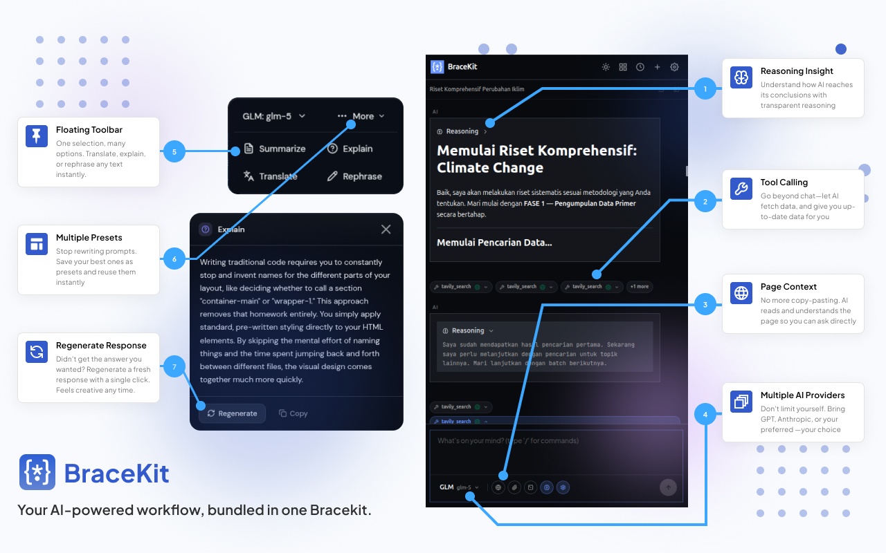

# BraceKit — AI Sidebar for Chrome

An AI-powered Chrome sidebar that reads the current page content and lets you chat with multiple LLM providers. Features **Slide Creator** (agent-built HTML slide decks), MCP (Model Context Protocol) support, conversation branching, an AI floating toolbar, and streaming responses with markdown rendering.

> **Bring Your Own Key (BYOK)** — BraceKit is free to use. You supply your own API keys (or sign in with Grok OAuth). No subscriptions, no telemetry, no data sent to BraceKit servers.

[](https://chromewebstore.google.com/detail/bracekit-ai-sidebar/kdlbihnhbaeoghamncndigpgnjociehh)
[](https://chromewebstore.google.com/detail/bracekit-ai-sidebar/kdlbihnhbaeoghamncndigpgnjociehh)

**[Documentation](https://bracekit.nexifle.com/guide/)**

## Features

- **Page Context Reading** — Read entire page content or grab highlighted text
- **Streaming AI Chat** — Real-time streaming responses with markdown rendering
- **Slide Creator** — Plan, build, and edit HTML slide decks with a live preview, HITL questions, and PNG export
- **Multi-Provider Support** — OpenAI, Claude, Gemini, xAI (API key or Grok OAuth), Groq, DeepSeek, Ollama, and custom endpoints
- **Per-Model Capabilities** — Vision, tools, and composer features are gated per model so unsupported models fail closed
- **MCP Support** — Connect MCP servers for tool usage
- **Web Search** — Grok sessions can use hosted xAI web search
- **AI Floating Toolbar** — Select text on any page to Summarize, Explain, Translate, Rephrase, and more
- **Conversation Branching** — Fork conversations at any point without losing context
- **File Attachments** — Attach images and text files; vision models analyze images automatically
- **Omnibox Quick Search** — Type `bk` in Chrome's address bar to start a new chat
- **Memory System** — Remembers preferences and context across conversations
- **Auto-Compact** — Automatically compresses long conversations to stay within context limits
- **Custom Configuration** — API keys, custom endpoints, system prompts, model selection
- **Light & Dark Theme** — Follows `prefers-color-scheme`; toggle from the header
- **Context Menu** — Right-click selected text to send directly to BraceKit
- **Conversation Memory** — Persistent chat history with search
- **Image Generation** — Gemini and xAI image generation with aspect ratio selection
- **Security Lock** — PIN protection for sensitive data

## Tech Stack

- **Runtime**: [Bun](https://bun.sh/)
- **UI Framework**: React 19 + TypeScript
- **State Management**: Zustand
- **Styling**: Tailwind CSS 4
- **Icons**: Lucide React
- **Build**: Bun bundler

## Installation

### Chrome Web Store (Recommended)

Install BraceKit directly from the [Chrome Web Store](https://chromewebstore.google.com/detail/bracekit-ai-sidebar/kdlbihnhbaeoghamncndigpgnjociehh). Updates are automatic.

### Build from Source

#### Prerequisites

- [Bun](https://bun.sh/) installed on your system
- Chrome browser

#### Build & Load

```bash
# Clone the repository
git clone <repo-url>
cd brace-kit

# Install dependencies
bun install

# Build the extension
bun run build
```

Then in Chrome:
1. Open `chrome://extensions/`
2. Enable **Developer mode** (top-right toggle)
3. Click **Load unpacked**
4. Select the `dist/` folder (not the project root)
5. Click the extension icon to open the sidebar

### Development

```bash
# Start dev server with hot reload
bun run dev

# Type checking
bun run typecheck
```

## Setup

1. Click the gear icon to open Settings
2. Select your LLM provider (OpenAI, Claude, Gemini, xAI, Groq, **Grok (OAuth)**, etc.)
3. Enter your API key, or for Grok OAuth complete the sign-in flow (no API key)
4. Optionally adjust the model, endpoint URL, or system prompt

Slide Creator needs a model that supports **function calling / tools**. The composer is gated from models that cannot run the agent loop.

## Usage

### Chat
- Type a message and press Enter or click Send
- Responses stream in real-time with markdown formatting
- Use slash commands: `/compact`, `/rename`

### Page Context
- Click the attach button or "Read Current Page" to attach page content
- The AI will have full context of the page when responding

### Highlighted Text
- Select text on any webpage — it automatically appears in the sidebar
- Or click "Grab Selection" to manually grab the current selection
- Right-click selected text → "Send to BraceKit"

### AI Floating Toolbar
- Select any text on a webpage to trigger the floating toolbar
- Choose from built-in actions or add your own custom prompts
- Apply results directly to editable fields on the page

### Conversation Branching
- Click the branch icon on any message to fork the conversation
- Explore alternative directions without losing your original context

### MCP Servers
- Open Settings → MCP Servers section
- Enter server name and URL, click "Connect Server"
- Connected tools are automatically made available to the AI

### Slide Creator
- Click the presentation icon in the header (sidebar may offer opening it in a new tab)
- Describe the deck; the agent **plans** first (`brief.md` / `design.md`), then you review and **Build**
- The agent may pause with structured questions — answer in the composer and it continues
- After build, follow-ups go through an **edit** phase (surgical patches, not a full rebuild)
- Use the filmstrip to navigate slides, the code viewer to inspect HTML/CSS, and export a PNG zip
- Projects persist locally (IndexedDB); you can stop a run and resume, reorder slides, and attach images or `.txt` files
- Requires a tool-capable model (Grok OAuth or any function-calling provider)

## Supported Providers

Fallback model lists come from `src/providers/presets.ts` / `modelCatalog.ts`. Providers with live fetch refresh the list when an API key is present. **Bold** is the default model.

| Provider | API Format | Models |
|----------|-----------|--------|
| OpenAI | OpenAI API | **gpt-5.6-sol**, gpt-5.6-terra, gpt-5.6-luna, gpt-5.5, gpt-5.4, gpt-oss |
| Anthropic (Claude) | Anthropic API | claude-fable-5, claude-opus-5, **claude-sonnet-5**, claude-haiku-4-5, claude-opus-4-8, claude-opus-4-7, claude-opus-4-6, claude-sonnet-4-6, claude-opus-4-5, claude-sonnet-4-5 |
| Google Gemini | Gemini API | **gemini-3.6-flash**, gemini-3.5-flash, gemini-3.5-flash-lite, gemini-3.1-pro, gemini-3.1-flash, gemini-3.1-flash-lite, gemini-3-flash, gemini-2.5-pro, gemini-2.5-flash, gemini-2.5-flash-lite; image: gemini-2.5-flash-image, gemini-3-pro-image, gemini-3.1-flash-image, gemini-3.1-flash-lite-image |
| xAI (Grok) | OpenAI API | **grok-4.6**, grok-4.5, grok-4.3, grok-4.20-0309-reasoning, grok-4.20-0309-non-reasoning, grok-4.20-multi-agent-0309, grok-build-0.1; image: grok-imagine-image, grok-imagine-image-pro, grok-imagine-image-quality |
| Groq | OpenAI API | groq/compound, **groq/compound-mini**, openai/gpt-oss-120b, openai/gpt-oss-20b, qwen/qwen3.6-27b, moonshotai/kimi-k2-instruct, minimaxai/minimax-m2.7 |
| DeepSeek | OpenAI API | **deepseek-v4-flash**, deepseek-v4-pro |
| Ollama | Local · Ollama | Any local model (fetched from the Ollama host) |
| Grok (OAuth) | OpenAI Responses API | **grok-4.6**, grok-4.5, grok-4.3, grok-4.20-0309-reasoning, grok-4.20-0309-non-reasoning, grok-4.20-multi-agent-0309, grok-build-0.1, grok-3-mini, grok-3-mini-fast, grok-composer-2.5-fast (sign-in, no API key; hosted web search) |
| Custom | Configurable | Any OpenAI / Anthropic / Gemini / Responses-compatible endpoint |

## Project Structure

```
brace-kit/
├── src/
│   ├── background/       # Service worker (handlers, services, tools)
│   ├── content/          # AI Floating Toolbar (selection UI)
│   ├── components/       # React UI (message, settings, slides, ui primitives)
│   ├── skills/           # Slide Creator phase skills (plan / build / edit)
│   ├── hooks/            # Custom React hooks
│   ├── providers/        # LLM provider abstraction
│   ├── services/         # Shared services
│   ├── store/            # Zustand state
│   ├── types/            # TypeScript types
│   ├── utils/            # Utility functions
│   ├── styles/           # Global CSS
│   ├── content.ts        # Content script entry point
│   ├── index.tsx         # Sidebar entry point
│   ├── tab.tsx           # New-tab workspace (Slide Creator)
│   └── onboarding.tsx    # Onboarding page
├── dist/                 # Built extension (load this in Chrome)
├── public/               # Static pages (slide-renderer sandbox)
├── tests/                # Unit tests (Bun test framework)
├── build.ts              # Build script
└── package.json
```

```bash
# Run unit tests
bun test
```
