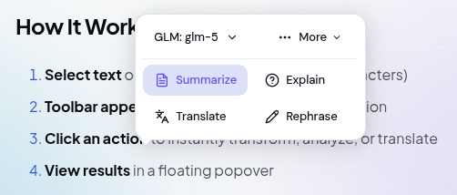

+++
title = "AI Floating Toolbar"
description = "Select any text and get instant AI-powered actions with the floating toolbar."
weight = 22
template = "page.html"

[extra]
category = "Core Features"
+++

# AI Floating Toolbar

The AI Floating Toolbar is your instant AI assistant that appears right when you need it. Select any text on a webpage and a sleek toolbar pops up with one-click AI actions no need to open the sidebar or type a prompt.

## How It Works

1. **Select text** on any webpage (minimum 10 characters)
2. **Toolbar appears** automatically near your selection
3. **Click an action** to instantly transform, analyze, or translate
4. **View results** in a floating popover

That's it! No typing, no context switching just select and act.

## Quick Actions

### Primary Actions

These actions appear directly on the toolbar for instant access:

| Action | What it does |
|--------|--------------|
| **Summarize** | Creates a concise summary of the selected text |
| **Explain** | Breaks down complex concepts into simple terms |
| **Translate** | Translates text to your chosen language |
| **Rephrase** | Rewrites text for better clarity and flow |

### Secondary Actions

Click the **More** menu (three dots) to access additional actions:

#### Transform
- **Simplify** — Makes complex text easier to understand
- **Expand** — Adds more detail and context to brief text

#### Change Tone
- **Make Formal** — Converts casual text to professional language
- **Make Casual** — Makes formal text more conversational

#### Fix & Improve
- **Fix Grammar** — Corrects grammar, spelling, and punctuation errors

## Using the Toolbar

### Basic Usage

1. Highlight any text on a webpage
2. A small BraceKit icon appears near your selection
3. Click the icon to expand the full toolbar
4. Click any action to execute it

### Translation

When you click **Translate**:

1. A language dropdown appears
2. Select your target language (12 languages available)
3. Click to translate

Supported languages: English, Spanish, French, German, Chinese, Japanese, Korean, Indonesian, Portuguese, Russian, Arabic, Hindi

### Changing AI Model

You can switch between AI models directly from the toolbar:

1. Click the model indicator (shows current provider/model)
2. Select from available providers
3. Choose a model from the dropdown
4. Your selection is saved for future use

> **Note:** Only providers with configured API keys appear in the selector.

## Working with Results

After executing an action, results appear in a floating popover:

### Available Actions

| Button | Function |
|--------|----------|
| **Regenerate** | Get a different result for the same action |
| **Copy** | Copy the result to your clipboard |
| **Apply** | Replace the original text (only in editable fields) |
| **Close** | Dismiss the popover |

### Drag to Reposition

The results popover can be dragged:

1. Click and hold the header area
2. Drag to any position on the page
3. Release to drop

The popover automatically stays within viewport boundaries.

### Applying Results

When you select text in an editable area (input field, textarea, or contenteditable element), the **Apply** button appears. Click it to replace your original selection with the AI-generated result.

Perfect for:
- Editing emails
- Improving document text
- Fixing grammar in forms

## Tips & Tricks

### Get Better Results

1. **Select complete sentences** — AI works best with full thoughts, not fragments

2. **Include context** — When explaining code, select enough surrounding code for context

3. **Use specific actions** — "Simplify" works better than "Rephrase" for making text easier to read

4. **Regenerate if needed** — Not happy with the result? Click Regenerate for a fresh take

### Productivity Shortcuts

- **Click outside** the toolbar to dismiss it quickly
- **Press Escape** to close the results popover
- **Minimum selection** is 10 characters adjust in settings if needed

### Best Use Cases

**For Research:**
- Summarize long articles instantly
- Translate foreign language sources
- Explain technical documentation

**For Writing:**
- Rephrase awkward sentences
- Fix grammar and typos
- Adjust tone for your audience

**For Learning:**
- Explain complex concepts
- Simplify difficult passages
- Translate for language learning

## Settings

Configure the floating toolbar in BraceKit settings:

| Setting | Description | Default |
|---------|-------------|---------|
| **Enable Toolbar** | Turn the floating toolbar on/off | On |
| **Minimum Selection Length** | Minimum characters to trigger toolbar | 10 |

Access via: Sidebar Settings → Text Selection

## Troubleshooting

### Toolbar Doesn't Appear

- **Selection too short** — Select at least 10 characters
- **Feature disabled** — Check settings in the sidebar
- **Incompatible page** — Some pages (Chrome Web Store, extension pages) don't allow content scripts
- **Code blocks excluded** — Toolbar intentionally doesn't appear inside code blocks

### Results Not Showing

- **API key missing** — Ensure your provider has a configured API key
- **Rate limited** — Wait 1 second between requests
- **Network error** — Check your internet connection

### Wrong Theme (Too Light/Dark)

The toolbar automatically detects the page theme. If it looks wrong:
- The page may use non-standard theming
- Try refreshing the page

## Related

- [Text Selection](/guide/core-features/text-selection/) — Send selected text to the sidebar chat
- [Chat Interface](/guide/core-features/chat/) — Full conversation with AI
- [AI Providers](/guide/ai-providers/) — Configure API keys and models
